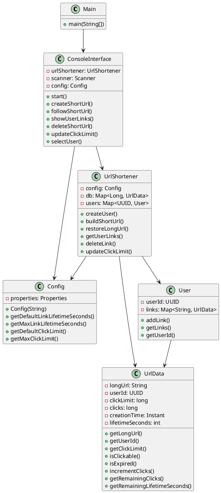
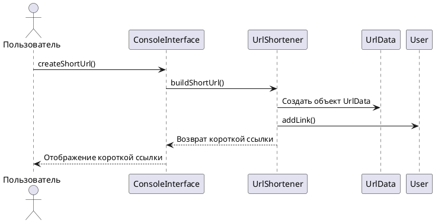
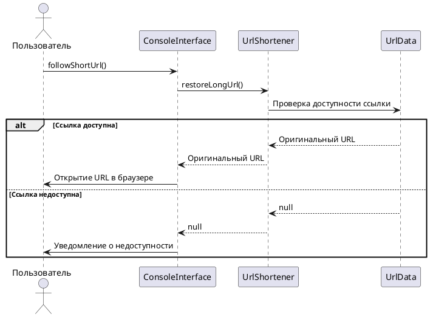

# Сервис сокращения ссылок

Проект "Сервис коротких ссылок" — консольное приложение для сокращения длинных URL-ссылок. Сервис позволяет пользователям создавать короткие ссылки, управлять ими (удалять, изменять лимит переходов) и переходить по созданным ссылкам. Также приложение умеет создавать несколько пользователей, которые могут иметь свой уникальный набор ссылок и их конфигурции.

Приложение использует конфигурационный файл **config.properties** , в котором хранятся конфигурации для указания предельных значений максимальное количества переходов (max.click.limit) и максимальное время жизни ссылки в секундах (max.link.lifetime.seconds). 
Помимо этих конфигураций есть default.click.limit, default.link.lifetime.seconds — но они не используются в самом приложении, оставлены на будущее (если нужна будет доработка, комментарий в коде оставил).

**Важно:** Сервис НЕ использует БД, поэтому созданные пользователи и все ссылки и параметры хранятся в памяти в момент работы приложения. После закрытия приложения все данные исчезнут (!).

---

## Как пользоваться сервисом

1. **Запуск приложения:**
    - Убедитесь, что у вас установлена Java (минимум версия 11).
    - Скачайте или клонируйте репозиторий.
    - Перейдите в корневую директорию проекта.
    - Запустите приложение средствами IDE.

2. **Консольный интерфейс:**
    - После запуска откроется консольный интерфейс, где вы сможете взаимодействовать с сервисом.
    - Следуйте инструкциям на экране для выполнения операций.

---

## Поддерживаемые команды

### Для неавторизованных пользователей:
- **Создать нового пользователя:**  
  Создает нового пользователя с уникальным UUID.
- **Выбрать существующего пользователя:**  
  Позволяет выбрать пользователя из списка для дальнейших операций.

### Для авторизованных пользователей ( UUID текущего пользователя будет отображаться в консоле):
- **Создать короткую ссылку:**  
  Позволяет создать короткую ссылку на основе длинного URL. Вы можете указать лимит переходов и время жизни ссылки.
- **Перейти по короткой ссылке:**  
  Переход по созданной короткой ссылке (открывает оригинальный URL в браузере).
- **Показать мои ссылки:**  
  Отображает все созданные пользователем ссылки с информацией о лимите переходов и времени жизни.
- **Удалить ссылку:**  
  Удаляет выбранную короткую ссылку.
- **Изменить лимит переходов:**  
  Позволяет изменить лимит переходов для выбранной ссылки.
- **Сменить пользователя:**  
  Выход из текущего аккаунта и возврат к выбору пользователя.
- **Выйти:**  
  Завершает работу приложения.

---
## UML-диаграммы

### Диаграмма классов

#### Описание диаграммы
- Main: Точка входа в программу. Зависит от ConsoleInterface.

- ConsoleInterface:Предоставляет пользовательский интерфейс.Зависит от UrlShortener и Config.

- UrlShortener: Основной класс, реализующий логику сокращения ссылок.Зависит от Config, UrlData и User.

- Config:Загружает и предоставляет доступ к параметрам конфигурации.Не зависит от других классов.

- UrlData:Хранит информацию о ссылке (URL, лимит переходов, время жизни и т.д.). Не зависит от других классов.

- User:Хранит информацию о пользователе и его ссылках.Зависит от UrlData.

### Диаграмма последовательностей

#### Сценарий: Создание короткой ссылки

#### Описание:
- Пользователь вызывает метод createShortUrl() в ConsoleInterface.

- ConsoleInterface передает запрос в UrlShortener через метод buildShortUrl().

- UrlShortener создает объект UrlData для хранения информации о ссылке.

- UrlShortener добавляет ссылку в коллекцию пользователя через метод addLink().

- UrlShortener возвращает короткую ссылку в ConsoleInterface.

- ConsoleInterface отображает короткую ссылку пользователю.

#### Сценарий: Переход по короткой ссылке

#### Описание:
- Пользователь вызывает метод followShortUrl() в ConsoleInterface.

- ConsoleInterface передает запрос в UrlShortener через метод restoreLongUrl().

- UrlShortener проверяет доступность ссылки в UrlData.

- Если ссылка доступна, возвращается оригинальный URL, и он открывается в браузере.

- Если ссылка недоступна, пользователь получает уведомление.

---
## Ручное тестирование
1. Запустите приложение (см. раздел Как пользоваться сервисом).

2. Следуйте инструкциям в консольном интерфейсе для выполнения различных операций:

- Создайте пользователя.

- Создайте несколько коротких ссылок.

- Перейдите по созданным ссылкам.

- Удалите или измените лимит переходов для ссылок.

- Проверьте уведомления о недоступности ссылок (например, при истечении времени жизни или достижении лимита переходов).

- Создать нескольких пользователей и проверить доступность ссылок по правам доступа (переход по чужой ссылке, удаление чужой ссылки, редактирование количества переходов у чужой ссылки)